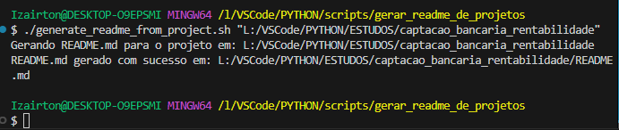

# 🗂️ Projeto: captacao_bancaria_rentabilidade

## 📝 Descrição

Este projeto foi analisado automaticamente pelo script e contém as seguintes configurações e informações. Ele tem como objetivo principal **(Descrever o objetivo principal)**.

## 🎯 Objetivo do Projeto

O objetivo principal deste projeto é **descrever o objetivo aqui**.

## 🚀 Funcionalidades

- **Funcionalidade 1:** Descrever a funcionalidade aqui.
- **Funcionalidade 2:** Melhorar integração com sistemas externos.
- **Funcionalidade 3:** Adicionar suporte para novas métricas.

## 📂 Estrutura do Projeto

Abaixo está uma visualização da estrutura do projeto (pastas primeiro, seguidas de arquivos):

├── data
├── docs
├── images
├── src
├── tests
├── convert_thumb.py
├── desktop.ini
├── gerar_relatorio.py
├── main.py
├── README.md
├── relatorio_rentabilidade.pdf
├── requirements.txt
├── setup_project.sh
├── USAGE.md

## 🏆 Benefícios do Gerador de README.md

- **Precisão:** Elimina erros manuais em cálculos financeiros.
- **Eficiência:** Automatiza análises complexas, economizando tempo.
- **Clareza:** Gera relatórios detalhados que auxiliam na tomada de decisões.

## 🖥️ Como Executar

1. Clone o repositório:

   git clone <https://github.com/seuusuario/captacao_bancaria_rentabilidade.git>

2. Navegue até o diretório do projeto:

   cd captacao_bancaria_rentabilidade

3. Configure o ambiente virtual (se necessário):

   python3 -m venv venv
   source venv/bin/activate

4. Instale as dependências:

   pip install -r requirements.txt

5. Execute o programa principal:

   python src/main.py

## 💻 Ambiente Virtual

Ambiente virtual configurado: **Não (usando requirements.txt)**

## 📦 Bibliotecas Utilizadas

As bibliotecas identificadas no projeto são:

pandas==2.2.3
tabulate==0.9.0

## 🚀 Tecnologias Utilizadas

As principais tecnologias utilizadas no projeto incluem:

- [Python](https://www.python.org/)
- Outras tecnologias podem ser descritas aqui.

## 🛠️ Tarefas

- [ ] Implementar validações adicionais.
- [x] Criar interface para usuários.
- [ ] Melhorar documentação.

## 🗂️ Histórico de Lançamento

- **0.2.0**
  - MUDANÇA: Remover função antiga
  - ADICIONAR: Implementar init()
- **0.1.1**
  - CORREÇÃO: Resolver travamento ao executar foo()
- **0.1.0**
  - MUDANÇA: Refatorar foo() para bar()
- **0.0.1**
  - Inicializar o projeto

## 🤝 Contribuições

Feedbacks e sugestões são sempre bem-vindos! Sinta-se à vontade para abrir **[issues](https://github.com/IOVASCON/projeto/issues)** ou enviar **[pull requests](https://github.com/IOVASCON/projeto/pulls)**.

Espero que este README seja útil para explicar o projeto e atrair atenção de colaboradores e usuários. Se precisar de ajustes ou personalizações, é só avisar! 🚀

## 👥 Autor

- [@iovascon](https://github.com/IOVASCON)

## 📜 Licença

Este projeto está sob a licença [MIT](https://opensource.org/licenses/MIT).
